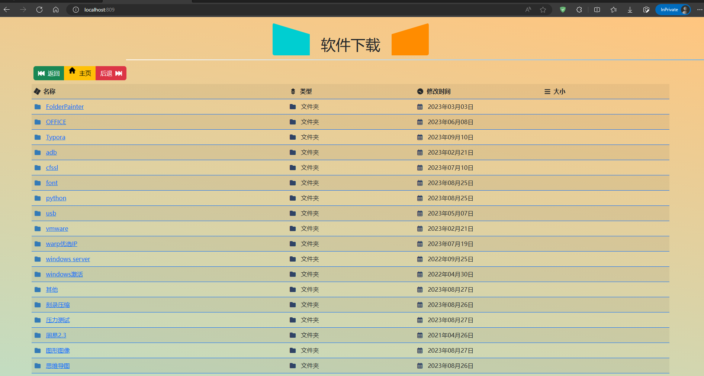
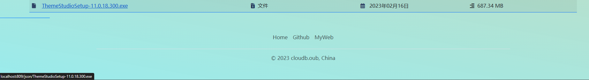
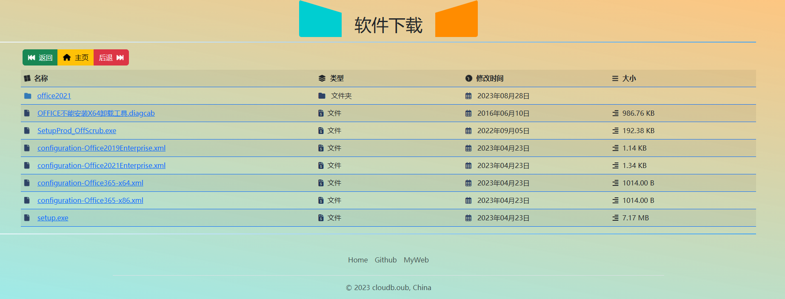
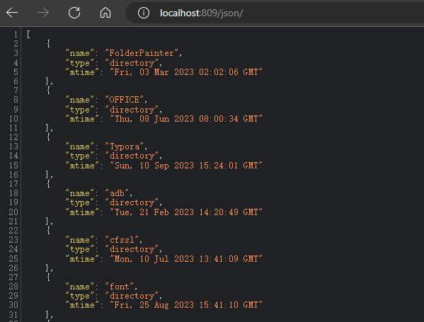

# nginx_autoindex 美化模板

## [update]

2024-7-2  js/dir.js 文件排除 ini,ico 图标文件。


## 预览







>   如果不喜欢你们可以自己调整色彩这些.

软件下载这个自己修改,

## 使用

搭配nginx使用.

nginx配置如下

```conf
	server {
		listen  809;
		server_name  localhost;
		
		charset utf-8;
		
		location / {
			root f:\\soft\\.theme\\;
			index index.html;
		}
		
		location /json/ {
			alias f:\\soft\\;
			index json;
			autoindex on;
			autoindex_format json;		
			autoindex_localtime on;
			autoindex_exact_size off;
			
			add_header  Access-Control-Allow-Origin "*";
			add_header  Access-Control-Allow-Methods "GET, POST, OPTIONS";
			add_header Access-Control-Allow-Headers 'DNT,X-Mx-ReqToken,Keep-Alive,User-Agent,X-Requested-With,If-Modified-Since,Cache-Control,Content-Type,Authorization';
			add_header  Access-Control-Allow-Credentials true;
		}
		
		 
		error_page   500 502 503 504  /50x.html;
        location = /50x.html {
            root   html;
        }
	}
```

>   关于跨域访问的问题,没有测试,应该问题不大.

把这css,js,index.html 文件复制到需要暴露的目录,推荐在该目录下创建 .theme 文件夹(注意这个文件夹前面有个点).然后按照上面的配置配置好nginx.

配置好nginx记得重载一下,linux下就是

```bash
$ nginx -s reload  
```

windows

```cmd
$ cd x:\younginx\
$ dir
... nginx.exe ... 就是切换到可以看到nginx.exe 这个位置
$ nginx -t   # 测试下配置文件是否正确
$ taskkill -f -im nginx.exe 结束nginx进程
$ nginx   再启动,这里不一定是这个命令.我自己开发的是 nginx-service restart ,
一般都是直接启动这个
❯❯❯ 16:10:02  D:\桌面 ❯❯❯ cd F:\apps\nginx\
❯❯❯ 16:10:05  F:\apps\nginx ❯❯❯ .\nginx.exe
```

什么是配置好?

就是当你输入URL/json/ 返回的是json数据,输入URL打开的是我这个index模板.



就这样就可以了.

这个后期维护只是自定义一些color样式什么的.而且是不定期.


